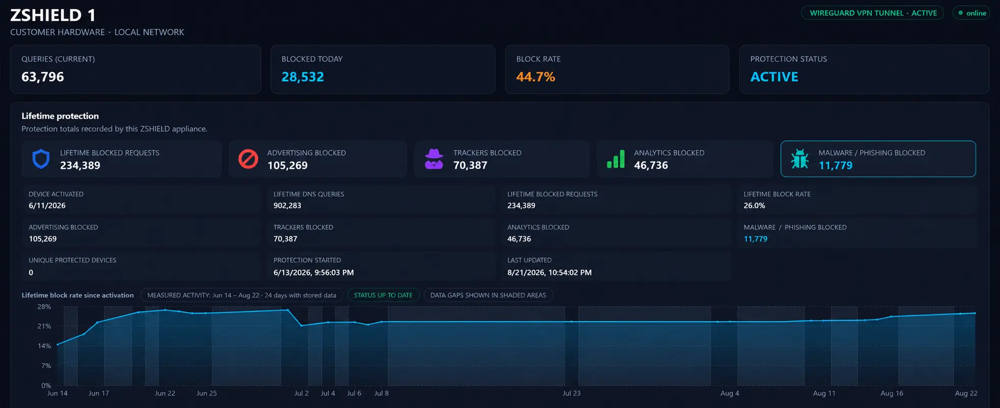

# ZSHIELD

**A local-first network privacy and threat-filtering appliance built on Raspberry Pi.**

ZSHIELD is supplied as dedicated hardware with the required software prepared by ZundaThreat. It filters DNS requests for a home or small-office network before known advertising, tracking, analytics, malware, and phishing domains can be reached.

> Project status: working prototype. ZSHIELD complements—but does not replace—endpoint protection, software updates, a firewall, and safe browsing practices.

<p align="center">
  <a href="docs/zshield-customer-dashboard.webp">
    
  </a>
</p>

[Open the full-size ZSHIELD dashboard image](docs/zshield-customer-dashboard.webp)

*Customer dashboard example. Displayed figures are an illustrative prototype snapshot and will differ for each appliance.*

### Prototype snapshot shown

The public dashboard example includes:

- 902,283 lifetime DNS queries
- 234,389 lifetime blocked requests
- 26.0% lifetime block rate
- **11,779 malware/phishing-list blocks**

These figures describe the displayed prototype measurement window. They are DNS filtering events and are not a promise of identical results for every customer.

## Customer setup

Customers begin after receiving a prepared ZSHIELD appliance:

1. Connect ZSHIELD to power.
2. Connect ZSHIELD to the router using Ethernet or the configured Wi-Fi connection.
3. Wait for the appliance to finish starting.
4. Configure the router or customer devices to use ZSHIELD as the DNS server.
5. Open the ZSHIELD hardware dashboard using the local address supplied with the appliance.

The dashboard is available on the customer's local network. ZSHIELD also supports WireGuard VPN tunnelling when configured by ZundaThreat. Authorized devices can connect through an encrypted tunnel, reach the ZSHIELD appliance, and use its DNS protection while away from the local network. The dashboard must not be exposed through ordinary public port forwarding.

Customers do not need to download this repository or run Linux installation commands. GitHub deployment files are intended for ZundaThreat development, manufacturing, repair, and advanced evaluation.

## Hardware dashboard

The dashboard displays:

- Current AdGuard Home DNS queries
- Blocked advertising and tracking requests
- Malware/phishing-list blocks reported by AdGuard Home
- Current block rate
- AdGuard Home connection state
- Raspberry Pi temperature, memory, storage, uptime, hostname, and local address

When AdGuard Home is disconnected, protection counters display **Unavailable** instead of misleading zeroes.

Counts represent DNS events. They are not confirmed cyberattacks, unique people, or unique devices.

## Current prototype hardware

| Component | Purpose |
| --- | --- |
| Raspberry Pi 4 Model B, 2 GB | Runs the filtering engine and dashboard |
| microSD storage | Operating system and application storage |
| 5.1 V / 3 A power supply | Stable appliance power |
| Ethernet or Wi-Fi | Local-router connection |
| WireGuard | Encrypted VPN tunnelling for authorized remote connectivity and ZSHIELD DNS protection |
| 7-inch DSI display | Optional appliance display |
| SATA SSD | Planned durable local storage |

## How it works

1. Network devices send DNS requests to ZSHIELD.
2. AdGuard Home compares requested domains with the enabled rules and filter lists.
3. Blocked domains are refused; allowed requests use the operator-selected upstream resolver.
4. The ZSHIELD dashboard reads aggregate counters and hardware health inside the appliance.
5. The customer views results through the ZSHIELD page on their local network.

See [docs/architecture.md](docs/architecture.md).

## RF-aware edge security research direction

ZSHIELD is also being used as a platform for continued research into local-first cyber-physical security. This research asks whether selected network, radio-frequency (RF), electromagnetic-spectrum, and physical-sensor observations can eventually be processed and correlated at the edge without sending every observation to a centralized cloud service.

Research and planned prototype development include:

- Software-defined radio (SDR) fundamentals, RF spectrum visualization, and lawful signal observation
- Electromagnetic-spectrum awareness, RF interference, and anomaly-awareness concepts
- Signal detection and characterization, including modulation and protocol-analysis fundamentals
- Integration of SDR-derived metadata and physical/wireless sensor events with Raspberry Pi edge-computing systems
- Network-security monitoring and IDS/IPS experimentation, including evaluation of Suricata and packet-analysis workflows
- Local edge-AI experimentation for event correlation, anomaly classification, and human-readable security explanations
- Multilingual local security explanations, with English, Turkish, and Swahili as development targets
- Raspberry Pi 5 with AI acceleration as an intermediate research platform
- Compute Module 5 (CM5) custom-PCB research for future integrated edge hardware

These items are **research and development directions**, not capabilities of the current ZSHIELD DNS-filtering prototype unless a feature is separately documented as implemented and tested.

### Relationship to signal-intelligence concepts

The research includes study of technical concepts that also appear in signal-analysis and intelligence disciplines, including RF environments, electronic emissions, signal characterization, SIGINT, COMINT, and ELINT terminology. ZSHIELD is **not represented as a military SIGINT, COMINT, or ELINT collection system**. The project focuses on lawful civilian RF/spectrum awareness, local cyber-physical security research, and edge processing.

### Research publication

This direction is discussed in the FrontierIQ analysis **“When Cybersecurity Leaves the Network: The Rise of RF-Aware Edge Security”**, which examines how network telemetry, software-defined radio, physical sensors, and local AI may converge in future edge-security architectures:

https://frontieriq.ca/article/when-cybersecurity-leaves-the-network-rf-aware-edge-security

## ZundaThreat deployment

These commands are for preparing or repairing a ZSHIELD appliance—not normal customer onboarding:

```bash
git clone https://github.com/ZUNDATHREAT/ZSHIELD.git
cd ZSHIELD
sudo bash scripts/install.sh
```

The installer places the application in `/opt/zshield`, configuration in `/etc/zshield/zshield.env`, and installs the `zshield.service` systemd unit.

## Service checks

```bash
sudo systemctl status zshield --no-pager
curl http://127.0.0.1:8080/health
sudo journalctl -u zshield -n 50 --no-pager
```

## Security boundaries

Keep the dashboard behind the customer's router/firewall. Do not expose its port through public router forwarding.

ZSHIELD filters DNS. It does not decrypt HTTPS, inspect file contents, prevent direct-to-IP connections, or replace endpoint security.

## Repository layout

```text
ZSHIELD/
├── app.py
├── static/
├── scripts/install.sh
├── systemd/zshield.service
├── docs/architecture.md
├── SECURITY.md
└── zshield.env.example
```

## License

Copyright © 2026 ZundaThreat. See [LICENSE](LICENSE).
