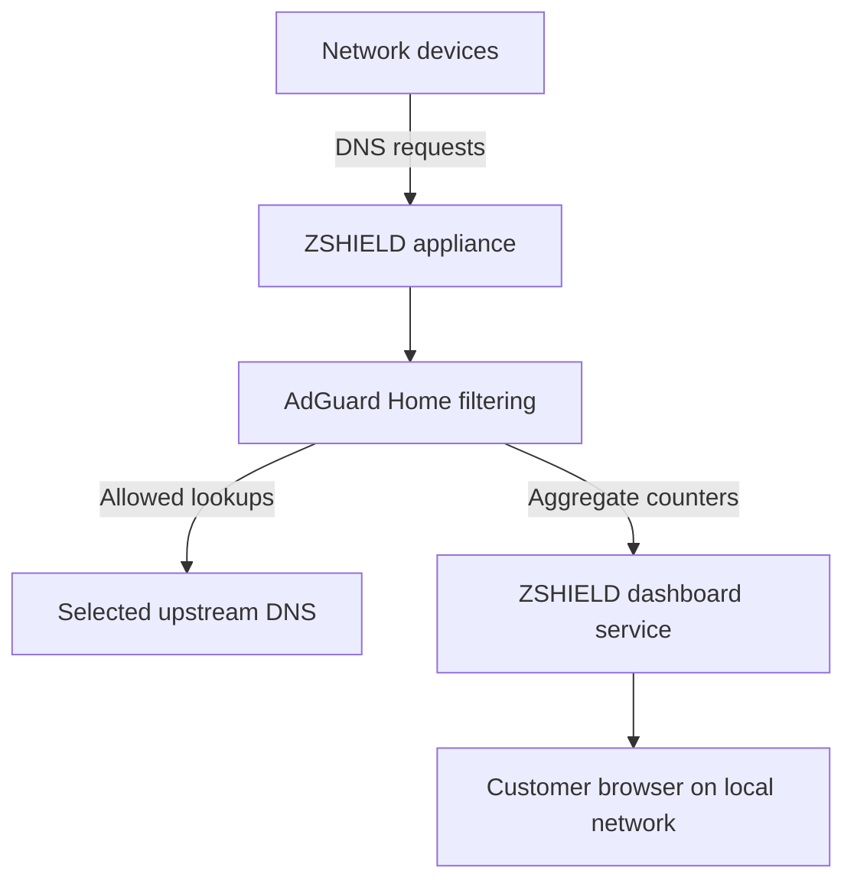

# ZSHIELD Architecture

ZSHIELD is a Raspberry Pi-based DNS privacy appliance supplied with its software prepared by ZundaThreat.

## Request flow

1. Customer devices use ZSHIELD as their DNS server.
2. AdGuard Home checks requested domains against configured rules and filter lists.
3. Blocked domains are refused; allowed requests go to the selected upstream resolver.
4. The dashboard service reads AdGuard Home aggregate counters and Raspberry Pi system health.
5. A browser on the same network reads the customer dashboard.

## Dashboard data

The dashboard response contains aggregate filtering counters, hostname, local address, system uptime, CPU temperature, memory utilization, and disk utilization. It does not need raw domain logs to display its summary.

## Network exposure

The dashboard listens on its configured local port. It must remain behind the customer's router/firewall and must not be exposed using public port forwarding.
