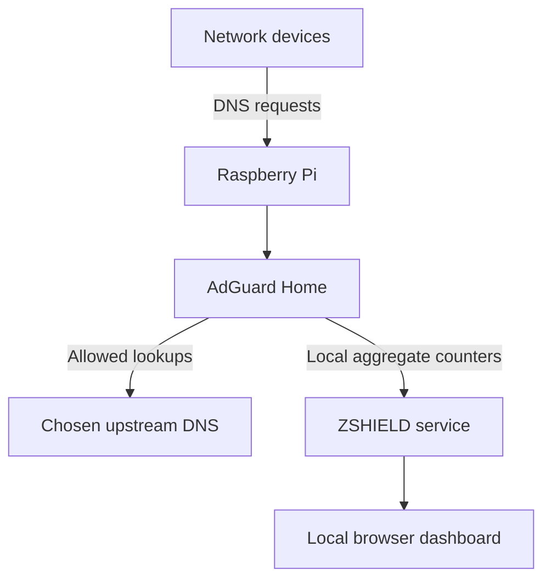

# ZSHIELD Architecture

ZSHIELD is a local-first DNS privacy appliance.

## Request flow

1. Devices use the Raspberry Pi as their DNS server.
2. AdGuard Home checks requested domains against locally configured rules and filter lists.
3. Blocked domains are refused; allowed lookups go to the operator-selected upstream resolver.
4. The ZSHIELD service reads aggregate counters from `http://127.0.0.1/control/stats`.
5. A browser on the LAN reads the local ZSHIELD endpoint at `/api/status`.

## No telemetry boundary

This public build has no code path from the ZSHIELD dashboard to a ZundaThreat backend or analytics provider. It does not implement heartbeat messages, remote node registration, cloud history, remote cumulative counters, or background reporting.

The local API response contains only:

- aggregate AdGuard Home counters;
- hostname and LAN IP;
- system uptime;
- CPU temperature;
- memory and disk utilization.

It does not expose raw queried domains, client names, MAC addresses, or a private-IP inventory.

## Network exposure

The service listens on port 8080 for LAN access. It must not be exposed through public router port forwarding. Future remote access should be delivered through an authenticated private VPN.
